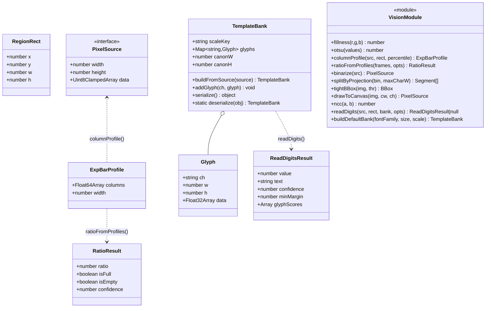
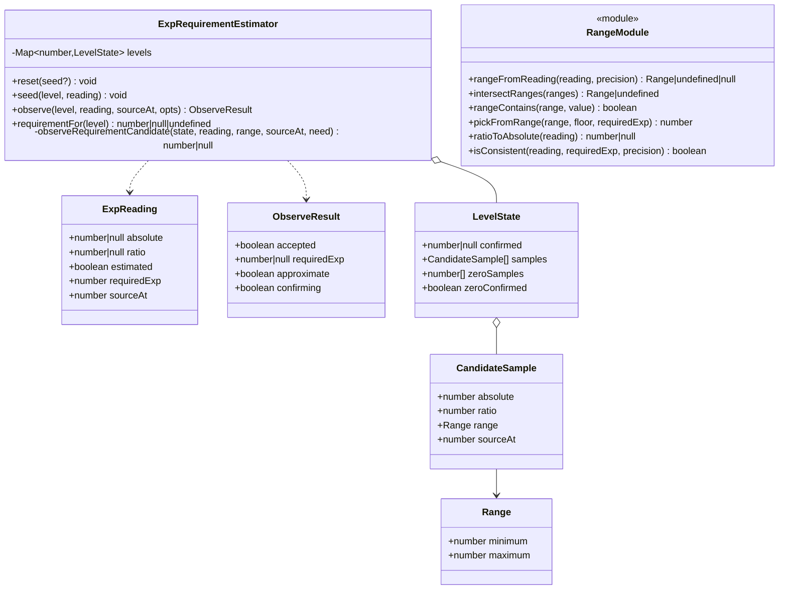
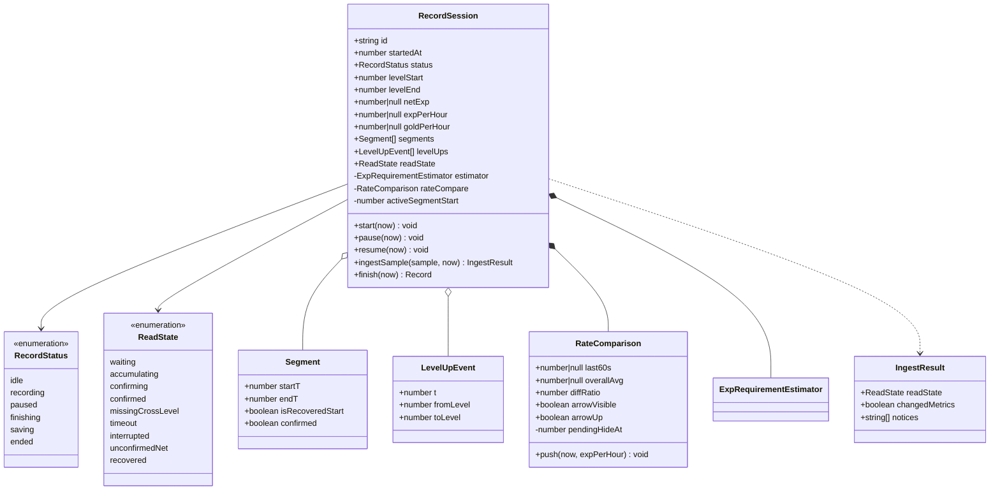
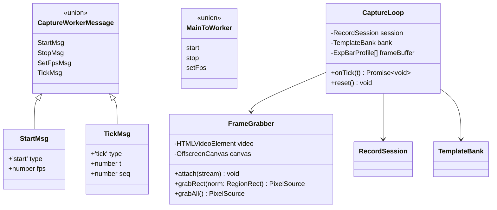
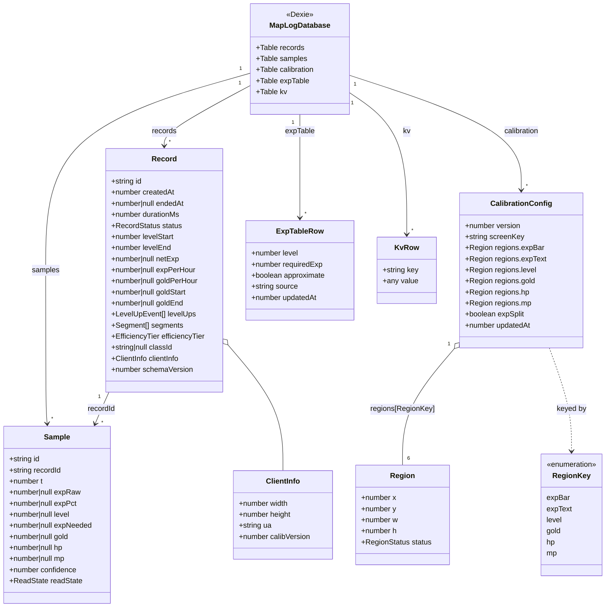
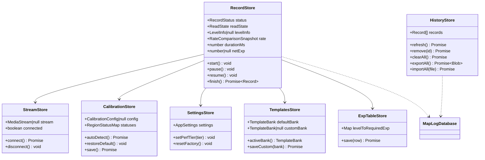
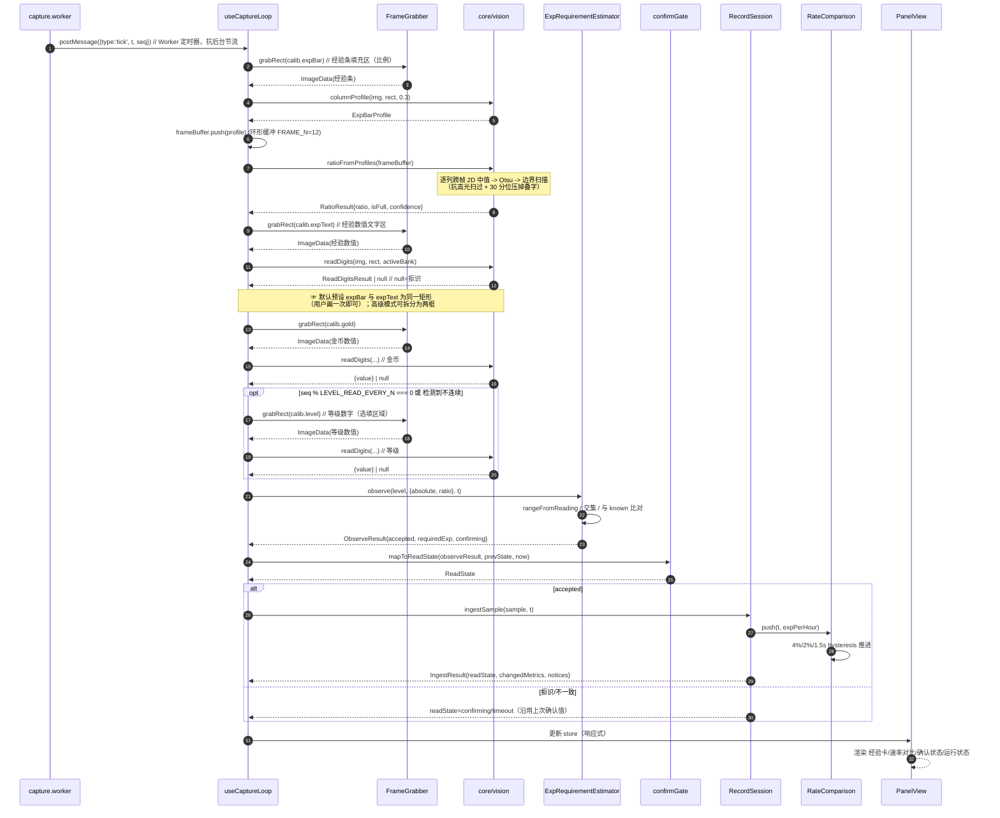
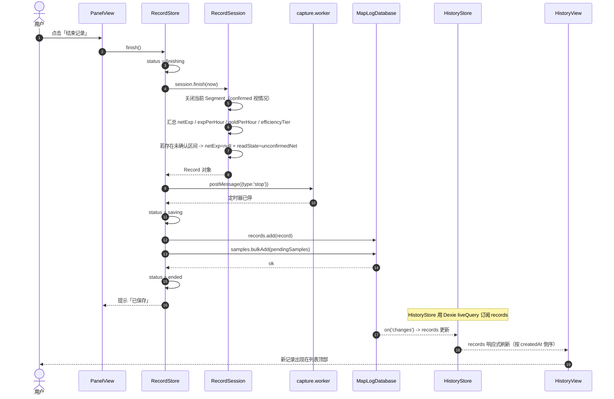
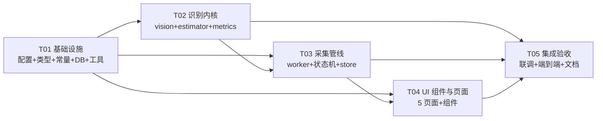

# 本地版冒险岛经验统计工具 —— 系统架构设计文档

> 项目名：`maple_exp_tracker`
> 版本：v1.0（P0 设计定稿）
> 架构师：高见远
> 日期：2026-09-17
> 输入依据：`PRD.md`（v1.0）+ `tech-probe.md`（技术预研报告）
> 配套图文件（与本文件同目录）：`class-diagram.mermaid`、`sequence-diagram.mermaid`
> 　（项目内建议置于 `docs/` 下，路径以仓库实际为准）

---

## 目录

1. [实现方案与框架选型](#1-实现方案与框架选型)
2. [完整文件列表](#2-完整文件列表)
3. [数据结构与接口（类图）](#3-数据结构与接口类图)
4. [程序调用流程（时序图）](#4-程序调用流程时序图)
5. [共享知识（跨文件约定）](#5-共享知识跨文件约定)
6. [依赖包列表](#6-依赖包列表)
7. [任务列表（含依赖与验收标准）](#7-任务列表含依赖与验收标准)
8. [probe 目录处理清单](#8-probe-目录处理清单)
9. [内置默认字形模板方案](#9-内置默认字形模板方案)
10. [待明确事项](#10-待明确事项)

---

## 1. 实现方案与框架选型

### 1.1 核心实现思路（一句话）

**用「Worker 定时器驱动采样 → Canvas 像素分析（经验条比例 + 固定字体模板匹配）→ 双源交叉校验（自举经验表）→ 状态机产出可信指标 → IndexedDB 沉淀历史」的纯前端本地管线。**

三条技术主线（均已在预研中验证）：

| 主线 | 方案 | 预研结论 |
|------|------|---------|
| **数据源** | `getDisplayMedia` 共享窗口 → 离屏 canvas 抓帧 | ✅ 可行（需 http://localhost 安全上下文） |
| **经验条比例** | 校准框 + 逐列中值剖面 + Otsu + **跨帧 2D 中值** | ✅ ±0.5px；跨帧 2D 中值是抗高光的唯一有效解 |
| **数值文字** | **固定字体数字模板匹配**（分割→归一化→NCC），Tesseract 仅 P2 兜底 | ✅ 干净样本 6/7、噪声±40 全过、平移缩放全过、字形 11/11 |
| **可信度** | 移植枫记 `rangeFromReading` 双源交叉校验 + 多帧区间交集自举经验表 | ✅ 3 帧收敛到真值 |

### 1.2 框架与库选型（复用预研结论）

| 层 | 选型 | 版本 | 理由 |
|----|------|------|------|
| 构建 | **Vite** | ^5 | 用户指定；原生 ESM、Worker 支持好（`?worker` 语法）、dev 秒启 |
| 框架 | **Vue 3** | ^3.5 | 用户指定；参考站枫记同款 3.5.42 |
| 语言 | **TypeScript** | ^5.4 | 核心算法（区间运算、状态机）必须有类型保护；`Number.isSafeInteger` 等语义关键 |
| UI 组件 | **Element Plus** | ^2.14 | 用户指定；参考站同款 2.14.5 |
| 状态 | **Pinia** | ^4 | 参考站同款 4.0.3；轻量、TS 友好、支持 setup store |
| 持久化 | **Dexie** | ^4.4 | 参考站同款 4.4.5；IndexedDB 封装成熟、`liveQuery` 响应式 |
| 图表（P1） | **uPlot** | ^1.6 | 参考站同款 1.6.32；~50KB，高频更新折线图首选（ECharts 太重） |
| 样式 | **Tailwind CSS** | ^3 | 快速布局；与 Element Plus 共存（用 `prefix` 或分层） |
| 路由 | **vue-router** | ^4 | 参考站同款（其用 5.3.0 beta，我们用稳定 4.x） |
| OCR 兜底 | **tesseract.js** | ^7 | 仅 P2，动态 `import()`；**不进 P0 包** |

> **刻意不引入**：`sharp`/`pngjs`（Node 专用，浏览器用 Canvas API）、任何在线服务 SDK、任何服务端框架。

### 1.3 架构分层

```
┌─────────────────────────────────────────────────────────────┐
│  views/         页面层（控制面板 / 校准 / 历史 / 设置 / 更新日志）│
│  components/    可复用 UI 组件                                  │
├─────────────────────────────────────────────────────────────┤
│  stores/        Pinia 状态（record / calibration / settings）    │
│  composables/   组合式逻辑（useCapture / useRecordSession）      │
├─────────────────────────────────────────────────────────────┤
│  core/          识别内核（纯函数、无 Vue 依赖、可单测）★核心资产  │
│   ├─ vision/    像素分析（profile / ratio / template / digit）  │
│   ├─ estimator/ 自举经验表 + 交叉校验（移植枫记算法）            │
│   └─ metrics/   指标计算（/小时、速率对比、分档）                │
├─────────────────────────────────────────────────────────────┤
│  workers/       capture.worker（定时器驱动，抗后台节流）         │
│  db/            Dexie 表定义 + 仓储层（records / calibration）   │
│  types/         全局类型与枚举常量                              │
│  constants/     阈值常量集中定义                                │
└─────────────────────────────────────────────────────────────┘
```

**核心设计原则**：`src/core/` 是**纯 TS、零 DOM、零 Vue**，所有输入输出都是普通对象 —— 这样可以用 vitest 直接对算法做单测（用预研的模拟位图作夹具），工程师改算法不会碰 UI。

---

## 2. 完整文件列表

> 目录根：`maple_exp_tracker/`。行数为**预估量级**（`S`<80 行 / `M` 80–250 行 / `L` 250–500 行）。

### 2.1 项目根与配置

| 相对路径 | 职责 | 量级 |
|---------|------|------|
| `package.json` | 依赖与脚本（dev/build/test/lint） | S |
| `vite.config.ts` | Vite 配置（vue 插件、tailwind、worker format=es、`server.host=localhost`、alias `@`） | S |
| `tsconfig.json` | TS 配置（strict、paths、`types:["vite/client"]`） | S |
| `tsconfig.node.json` | vite.config 的 TS 配置 | S |
| `tailwind.config.ts` | Tailwind 配置（content 扫 src） | S |
| `postcss.config.js` | PostCSS（tailwind + autoprefixer） | S |
| `index.html` | 入口 HTML（`<div id="app">`、noindex、「游戏画面仅在当前设备处理」meta） | S |
| `.gitignore` | 忽略 node_modules/dist | S |
| `env.d.ts` | Vite 环境与 `*.worker` 模块声明 | S |
| `README.md` | 启动说明（**必须 http://localhost 访问**） | S |
| `vitest.config.ts` | 单测配置（environment=node + jsdom 可选） | S |

### 2.2 应用入口与全局

| 相对路径 | 职责 | 量级 |
|---------|------|------|
| `src/main.ts` | 创建 app、装 Pinia + Router + Element Plus、挂载 | S |
| `src/App.vue` | 根组件：顶部 tab 导航（控制面板/识别校准/历史记录/更新日志/设置）+ `<router-view>` | M |
| `src/router/index.ts` | 路由表（5 个页面，默认重定向 `/panel`） | S |
| `src/styles/main.css` | 全局样式（Tailwind 指令、等宽数字字体类 `.tabular`） | S |
| `src/styles/element-override.css` | Element Plus 主题微调 | S |

### 2.3 `src/types/` —— 类型与枚举

| 相对路径 | 职责 | 量级 |
|---------|------|------|
| `src/types/index.ts` | 统一出口（re-export） | S |
| `src/types/enums.ts` | **状态机枚举 + 字符串常量表**（`RecordStatus` / `ReadState` / `RegionStatus` / `EfficiencyTier` / `PerfTier`），**与存储层/UI 共用** | M |
| `src/types/models.ts` | 数据模型接口：`Record` / `Sample` / `Segment` / `LevelUpEvent` / `LevelInfo` | M |
| `src/types/calibration.ts` | 校准模型：`CalibrationConfig` / `Region` / `RegionRect`（归一化） | S |
| `src/types/vision.ts` | 识别内核接口：`ExpReading` / `TemplateBank` / `Glyph` / `Profile` | M |
| `src/types/messages.ts` | **Worker ↔ 主线程消息协议**（见 §5.6） | M |
| `src/types/ipc.ts` | `CaptureRequest` / `CaptureResponse` 等 IPC 载荷类型 | S |

### 2.4 `src/constants/` —— 阈值常量集中定义★

| 相对路径 | 职责 | 量级 |
|---------|------|------|
| `src/constants/index.ts` | 出口 | S |
| `src/constants/thresholds.ts` | **所有魔法数字**：`FRAME_N=12` / `NCC_MIN=0.55` / `NCC_MARGIN=0.03` / `PROFILE_PERCENTILE=0.3` / `MAX_BAR_HOLES_RATIO=0.01` / `RATE_ARROW=0.04` / `RATE_HIDE=0.02` / `RATE_HIDE_DELAY_MS=1500` / `ZERO_CONFIRM_SAMPLES=3` / `SAMPLE_CACHE_PER_LEVEL=3` / `MONO_EPS=2e-4` / `PERCENTAGE_PRECISION=2` | M |
| `src/constants/perf.ts` | 性能档位 → (captureFps, checkFps) 映射表 | S |
| `src/constants/regions.ts` | **`RegionKey` 元数据表 `REGION_META`**（标签/必填性/消费者）+ `DEFAULT_REGIONS` 默认框选位置；区域清单唯一真相源 | S |
| `src/constants/defaults.ts` | 出厂默认（`AppSettings` / `CalibrationConfig` 默认值、默认框选位置） | M |

### 2.5 `src/core/vision/` —— 像素识别内核（纯函数）★

| 相对路径 | 职责 | 量级 |
|---------|------|------|
| `src/core/vision/color.ts` | **`fillness(r,g,b) = r - 1.2*b + 0.2*g`** 单一来源；`pixelAt(imgData,x,y)`；颜色空间转换 | S |
| `src/core/vision/otsu.ts` | Otsu 自适应阈值（可配 bins） | M |
| `src/core/vision/profile.ts` | `columnProfile(imgData, rect, percentile)` → `Float64Array`（逐列分位数；抗条上白字） | M |
| `src/core/vision/ratio.ts` | `ratioFromProfiles(frames, opts)` → `{ratio, full|null, empty, confidence}`（**跨帧 2D 中值 + 全满/全空检测 + 边界扫描**） | M |
| `src/core/vision/binarize.ts` | 灰度化 + 二值化（自适应阈值） | S |
| `src/core/vision/segment.ts` | `splitByProjection(bin, maxCharW)` → `Segment[]`（列投影谷值分割 + 过宽段贪心切分） | M |
| `src/core/vision/normalize.ts` | `tightBBox` / `crop` / `drawToCanvas`（缩放填充到 CANON 画布）/ `to01` / `bboxBinary` | M |
| `src/core/vision/ncc.ts` | `ncc(a,b)`（CANON 画布上的归一化互相关）+ `corr` | S |
| `src/core/vision/templateBank.ts` | `TemplateBank` 类：`buildScale×outline`、`serialize/deserialize`、`fromImageData`（从截图切字形） | L |
| `src/core/vision/readDigits.ts` | `readDigits(imgData, rect, bank, opts)` → `{value, text, confidence, glyphs}`；拒识返回 `null` | L |
| `src/core/vision/glyphSource.ts` | **默认字形模板生成**：Canvas `fillText` 渲染无衬线字体 0-9 `%,./` → `TemplateBank`（见 §9） | M |
| `src/core/vision/index.ts` | 出口 | S |

### 2.6 `src/core/estimator/` —— 自举经验表 + 交叉校验★

| 相对路径 | 职责 | 量级 |
|---------|------|------|
| `src/core/estimator/rangeFromReading.ts` | **移植枫记核心**：`rangeFromReading(reading, precision)` / `intersectRanges` / `rangeContains` / `pickFromRange` / `ratioToAbsolute` / `isConsistent` | M |
| `src/core/estimator/ExpRequirementEstimator.ts` | `ExpRequirementEstimator` 类：`reset/seed/observe/requirementFor/observeRequirementCandidate`（按等级维护 `confirmed` + 样本累积） | L |
| `src/core/estimator/guards.ts` | 纯判定：`isValidReading` / `isValidLevel` / `toRequiredExp` / `isMonotonicSample` | S |
| `src/core/estimator/index.ts` | 出口 | S |

### 2.7 `src/core/metrics/` —— 指标计算

| 相对路径 | 职责 | 量级 |
|---------|------|------|
| `src/core/metrics/expPerHour.ts` | `expPerHour(deltaExp, deltaMs)`、`netExp`、`goldPerHour`、`durationMs` | S |
| `src/core/metrics/rateCompare.ts` | 「近 60 秒 vs 全程平均」+ 4%/2%/1.5s hysteresis 状态推进（纯函数，输入 prev+now 输出 next） | M |
| `src/core/metrics/segments.ts` | `Segment[]` 维护：开区间/闭区间、恢复起点、`confirmed` 标记 | M |
| `src/core/metrics/efficiencyTier.ts` | 效率分档 `low/mid/high/veryHigh`（4 档文案映射） | S |
| `src/core/metrics/levelProgress.ts` | 由 `level+expNeeded+currentExp` 推 `expToNext`，生成 `LevelInfo` | S |
| `src/core/metrics/discontinuity.ts` | `isExpRatioDiscontinuity(prevRatio, ratio, threshold?)` —— 经验条比例「单向下降」谓词，触发立即重读等级（见 §5.9） | S |
| `src/core/metrics/index.ts` | 出口 | S |

### 2.8 `src/core/record/` —— 记录状态机

| 相对路径 | 职责 | 量级 |
|---------|------|------|
| `src/core/record/RecordSession.ts` | **记录会话核心**：持有 `RecordStatus`、累计值、`ExpRequirementEstimator`、`Segment[]`、`LevelUpEvent[]`；`start/pause/resume/finish/ingestSample` | L |
| `src/core/record/recordMachine.ts` | 状态迁移表 + 守卫（`canTransition`），纯函数 | M |
| `src/core/record/confirmGate.ts` | 「读数确认」逻辑：把 `ExpRequirementEstimator.observe` 结果映射到 `ReadState`（waiting/accumulating/confirming/confirmed/timeout/interrupted/missingCrossLevel/unconfirmedNet/recovered） | L |
| `src/core/record/index.ts` | 出口 | S |

### 2.9 `src/workers/` —— Worker

| 相对路径 | 职责 | 量级 |
|---------|------|------|
| `src/workers/capture.worker.ts` | 定时器驱动（`setInterval`，受 `captureFps` 控制），`postMessage({type:'tick', t})` 到主线程；支持 `start/stop/setFps`；**抗后台节流** | M |
| `src/workers/recognize.worker.ts` | （P0 可选优化）承接重识别任务：接收 `ImageBitmap` + rect + bank，回传识别结果。**P0 可先不启用，保留接口** | M |
| `src/workers/README.md` | worker 与主线程协议说明（与 `types/messages.ts` 对齐） | S |

### 2.10 `src/db/` —— 持久化

| 相对路径 | 职责 | 量级 |
|---------|------|------|
| `src/db/database.ts` | Dexie 实例 + 表定义（`records` / `samples` / `calibration` / `expTable` / `kv`）+ 版本迁移 | M |
| `src/db/recordsRepo.ts` | 记录仓储：`add/list/remove/clear/exportAll/importAll`（含幂等 id 合并策略入口） | M |
| `src/db/samplesRepo.ts` | 采样点仓储：`bulkAdd/byRecord/降采样` | M |
| `src/db/calibrationRepo.ts` | 校准仓储：`get/save`（键 `screenKey`） | S |
| `src/db/kvRepo.ts` | 通用键值（设置、模板库、经验表） | S |
| `src/db/expTableRepo.ts` | 自举经验表持久化：`get(level)/put(level, requiredExp, approximate, source)` | S |
| `src/db/index.ts` | 出口 | S |

### 2.11 `src/stores/` —— Pinia

| 相对路径 | 职责 | 量级 |
|---------|------|------|
| `src/stores/record.ts` | 记录状态：`status`、实时指标、`ReadState`、`samples` 缓冲；`start/pause/resume/finish` | L |
| `src/stores/stream.ts` | 共享流状态：`MediaStream`、video 元素、canvas、`connected`、`connect/disconnect` | M |
| `src/stores/calibration.ts` | 校准状态：`regions`、`screenKey`、`statuses`、`autoDetect/restoreDefault/save` | M |
| `src/stores/settings.ts` | 设置：`perfTier`、`captureFps`、`checkFps`、rateCompare 阈值 | S |
| `src/stores/history.ts` | 历史列表（`liveQuery` 订阅 `records`） | M |
| `src/stores/expTable.ts` | 经验表状态（读取/自举写入） | S |
| `src/stores/templates.ts` | 字形模板库状态（`default`/`custom` 切换、保存） | M |
| `src/stores/ui.ts` | 全局 UI（当前 tab、toast、诊断信息复制） | S |

### 2.12 `src/composables/` —— 组合式逻辑

| 相对路径 | 职责 | 量级 |
|---------|------|------|
| `src/composables/useDisplayStream.ts` | `getDisplayMedia` 封装：请求、video 元素、断流监听、重选 | M |
| `src/composables/useFrameGrabber.ts` | 抓帧到 OffscreenCanvas/ImageData；rect → ImageData 裁剪（归一化坐标 → 像素） | M |
| `src/composables/useCaptureLoop.ts` | **主采样管线**：Worker tick → 抓帧 → profile → ratio → readDigits → estimator → RecordSession → UI（见 §4.2 时序） | L |
| `src/composables/useRecordSession.ts` | 记录生命周期编排（start/pause/resume/finish → 状态机 + 保存） | M |
| `src/composables/useAutoCalibrate.ts` | 「自动识别」：扫描画面尝试定位经验条/金币/HP/MP | L |
| `src/composables/useGlyphCapture.ts` | 模板采集向导逻辑：截取 → 分割 → 命名 → 保存 | M |
| `src/composables/usePageVisible.ts` | `visibilitychange` 监听 + 后台提示 + 回前台补采 | S |

### 2.13 `src/views/` —— 页面

| 相对路径 | 职责 | 量级 |
|---------|------|------|
| `src/views/PanelView.vue` | **控制面板**（三步引导 + 经验卡 + 金币卡 + 角色卡 + 速率对比 + 趋势图占位 + 运行状态） | L |
| `src/views/CalibrationView.vue` | **识别校准页**（画面预览 + 6 区域框选 + 自动识别/恢复默认 + 定位状态） | L |
| `src/views/HistoryView.vue` | **历史记录页**（列表 + 导出/导入/清除 + 空状态） | L |
| `src/views/SettingsView.vue` | **设置页**（性能档位 + 频率 + 恢复出厂） | M |
| `src/views/ChangelogView.vue` | 更新日志页（P0 仅占位静态内容） | S |

### 2.14 `src/components/` —— 组件

| 相对路径 | 职责 | 量级 |
|---------|------|------|
| `src/components/AppHeader.vue` | 顶部标题栏 + tab 导航（含「本地处理」提示） | M |
| `src/components/StepGuide.vue` | 三步引导（选择窗口→校准→开始），步骤态/禁用逻辑 | M |
| `src/components/StatCard.vue` | 通用指标卡（标题 + 数值 + 副文案，等宽数字，未确认置灰） | S |
| `src/components/ExpCard.vue` | 经验数据卡（等级/当前经验/百分比/本级共需/距升级） | M |
| `src/components/GoldCard.vue` | 金币数据卡（余额 + 金币/小时 + 自动识别入口） | M |
| `src/components/CharacterCard.vue` | HP/MP 卡（P1 启用，P0 可渲染占位） | M |
| `src/components/RateCompare.vue` | 速率对比块（近60秒/全程平均/差值 + 4%箭头 + hysteresis） | M |
| `src/components/ReadStateHint.vue` | 确认状态一行小字（文案 + 警告色 + 解释） | M |
| `src/components/RunStatus.vue` | 运行状态（画面读取状态 / 数据更新时间） | S |
| `src/components/RegionSelector.vue` | 校准页的可拖拽/缩放矩形选框（叠加在预览 canvas 上） | L |
| `src/components/RegionStatusList.vue` | 区域列表（经验条/金币/HP/MP 的 ✓已定位/✗未定位/识别中） | S |
| `src/components/RecordControls.vue` | 开始/暂停/继续/结束 按钮组 + 状态文案 | M |
| `src/components/RecordListItem.vue` | 历史单条卡片（时间/等级变化/时长/净经验/每小时 + 查看详情） | M |
| `src/components/GlyphWizardDialog.vue` | **模板采集向导对话框**（截图→分割→校正→保存） | L |
| `src/components/EmptyState.vue` | 通用空状态 | S |
| `src/components/TrendChart.vue` | 效率趋势图（**P1**，用 uPlot 封装；P0 先留组件骨架） | L |

### 2.15 `src/utils/`

| 相对路径 | 职责 | 量级 |
|---------|------|------|
| `src/utils/format.ts` | 数字千分位、时间 `HH:mm:ss`、百分比、大数缩写（2.1M） | S |
| `src/utils/uuid.ts` | `crypto.randomUUID()` 封装 | S |
| `src/utils/screenKey.ts` | 由分辨率/窗口尺寸/UA 指纹生成 `screenKey` | S |
| `src/utils/json.ts` | 导出/导入 JSON 的序列化与校验（schema 版本） | M |
| `src/utils/download.ts` | Blob 下载 / 文件读取 | S |
| `src/utils/diag.ts` | 「复制诊断信息」组装 | S |

### 2.16 `tests/` —— 单测（用预研产物作夹具）

| 相对路径 | 职责 | 量级 |
|---------|------|------|
| `tests/core/vision/ratio.spec.ts` | 比例识别：干净/噪声/高光/多帧 2D 中值 | M |
| `tests/core/vision/readDigits.spec.ts` | 模板匹配：字形/缩放/平移/噪声/拒识 | M |
| `tests/core/estimator/estimator.spec.ts` | `rangeFromReading`/交集/自举收敛/升级重置 | M |
| `tests/core/metrics/rateCompare.spec.ts` | 4%/2%/1.5s hysteresis | S |
| `tests/core/record/recordMachine.spec.ts` | 状态机迁移 | S |
| `tests/fixtures/` | **从 `probe/` 拷贝的模拟位图 + JSON 期望值**（见 §8） | — |

---

## 3. 数据结构与接口（类图）

### 3.1 识别内核（vision）



**关键函数签名（TS）**

```ts
// color.ts —— fillness 的单一定义处，全局唯一
export function fillness(r: number, g: number, b: number): number;   // r - 1.2*b + 0.2*g

// profile.ts
export function columnProfile(
  src: PixelSource, rect: RegionRect, percentile: number /* 默认 0.3 */
): ExpBarProfile;

// ratio.ts —— 跨帧 2D 中值（抗高光的关键）
export interface RatioOptions {
  frameCount: number;        // FRAME_N = 12
  maxHolesRatio: number;     // 0.01
  fullEmptyDelta: number;    // 6（fillness 动态范围低于此判全满/全空）
}
export function ratioFromProfiles(
  frames: ExpBarProfile[], opts?: Partial<RatioOptions>
): RatioResult;

// readDigits.ts
export interface ReadDigitsOptions {
  nccMin: number;            // 0.55
  nccMargin: number;         // 0.03
  allowChars: string;        // '0123456789%,./'
}
export function readDigits(
  src: PixelSource, rect: RegionRect, bank: TemplateBank, opts?: Partial<ReadDigitsOptions>
): ReadDigitsResult | null;  // null = 拒识（绝不返回猜测值）
```

### 3.2 自举经验表 + 交叉校验（estimator）



**关键签名**

```ts
// rangeFromReading.ts —— 移植枫记（tol=0.5*10^-precision/100）
export function rangeFromReading(
  reading: Pick<ExpReading,'absolute'|'ratio'|'estimated'>, precision?: number /*2*/
): Range | undefined | null;   // null=空条; undefined=无效/读不到; Range=可行区间

export function intersectRanges(ranges: Range[]): Range | undefined;
export function rangeContains(r: Range, v: number): boolean;
export function pickFromRange(r: Range, floor?: number, requiredExp?: number|null): number;

// ExpRequirementEstimator.ts
export interface ObserveOptions {
  requiredExp?: number;            // 若已知（内置表/已确认）
  percentagePrecision?: number;    // 2
  independentlyConfirmed?: boolean;// 强制 1 帧确认
}
export class ExpRequirementEstimator {
  reset(seed?: {level:number; value:{requiredExp?:number; absolute?:number; ratio?:number}}): void;
  seed(level:number, reading: ExpReading): void;
  observe(level:number, reading: ExpReading, sourceAt:number, opts?:ObserveOptions): ObserveResult;
  requirementFor(level:number): number | null | undefined; // undefined=未知, null=确认为空
}
```

### 3.3 记录会话与状态机（record）



**关键签名**

```ts
export type RecordStatus = 'idle'|'recording'|'paused'|'finishing'|'saving'|'ended';
export type ReadState =
  | 'waiting'|'accumulating'|'confirming'|'confirmed'
  | 'missingCrossLevel'|'timeout'|'interrupted'|'unconfirmedNet'|'recovered';

export interface IngestResult {
  readState: ReadState;
  changedMetrics: boolean;
  notices: string[];        // 供 UI 显示的异常文案 key
}
```

### 3.4 采集管线与 Worker 协议



### 3.5 持久化（db）



### 3.5.1 区域清单定稿（`RegionKey` 唯一真相源）★

**结论：共 6 个区域** —— `expBar` / `expText` / `level` / `gold` / `hp` / `mp`。

**为何不是 5 个（裁定修正团队建议）**：两处硬证据指向 6 个独立键 ——
1. **参考站枫记的校准表就是 6 区域**（`tech-probe.md` §6.3 反推得 `regions:{expBar,expText,level,mesos,hp,mp}`）；
2. **本团队预研伪代码**（`tech-probe.md` §9.1）亦同时使用 `calib.expBar`（喂 `columnProfile`）与 `calib.expText`（喂 `readDigits`）**两个 key**。

**同时解决「文字叠在条上」的痛点**：
- 经验条的**填充比例**由 `columnProfile(..., 0.3)` 逐列 30 分位算（该分位天然把叠印的白色数字压掉，见预研实验 C）；
- 经验**数值文字**由 `readDigits` 读；
- 两者是**同一物理区域的两种测量**（这正是双源交叉校验的前提），但**保留为两个 key** 以便：(a) 与枫记 schema 对齐、便于未来数据互操作；(b) 文字实际可能偏上/偏侧，独立成框可各自贴紧裁剪，识别更准。

**默认预设 `expBar === expText`（同一矩形）**，用户**默认只画一次**（在框选 UI 上用「经验条/数值」联动开关，默认联动）；高级模式可解开联动、把两框分开。这样既不牺牲易用性，又保留最大灵活性与参考站兼容性。

| RegionKey | 物理含义 | 消费者 | 必填 | 默认框选 | 默认与谁联动 |
|-----------|---------|--------|------|---------|------------|
| `expBar` | 经验条填充区 | `columnProfile`（比例） | 必填 | 中部经验条 | 与 `expText` 同矩形 |
| `expText` | 经验数值文字 | `readDigits`（当前经验绝对值） | 必填 | 同上（默认重合） | 与 `expBar` 同矩形 |
| `level` | 等级数字 | `readDigits`（等级） | **选填** | 角色信息区等级 | — |
| `gold` | 金币数值 | `readDigits` | 必填 | 金币栏 | — |
| `hp` | HP 数值 | `readDigits` | 选填 | 左下 HP | — |
| `mp` | MP 数值 | `readDigits` | 选填 | 左下 MP | — |

定稿类型（`src/types/calibration.ts`）：

```ts
export type RegionKey = 'expBar' | 'expText' | 'level' | 'gold' | 'hp' | 'mp';

/** 归一化坐标（相对原始视频尺寸，0–1） */
export interface Region {
  x: number; y: number; w: number; h: number;
  status: RegionStatus;         // located | unlocated | identifying
}

export interface CalibrationConfig {
  version: number;
  screenKey: string;                    // 分辨率 + DPR + UA 摘要
  regions: Record<RegionKey, Region>;   // 恒为 6 键；选填/未校准键 status='unlocated'
  expSplit: boolean;                    // false(默认) = expBar 与 expText 联动同矩形；true = 已拆分
  updatedAt: number;
}

/** 区域元数据表（UI 标签、必填性、消费者），唯一定义在 constants/regions.ts */
export const REGION_META: Record<RegionKey, {
  label: string; required: boolean; consumers: ('ratio' | 'digits')[];
}> = {
  expBar:  { label: '经验条',   required: true,  consumers: ['ratio'] },
  expText: { label: '经验数值', required: true,  consumers: ['digits'] },
  level:   { label: '等级',     required: false, consumers: ['digits'] },
  gold:    { label: '金币',     required: true,  consumers: ['digits'] },
  hp:      { label: 'HP',       required: false, consumers: ['digits'] },
  mp:      { label: 'MP',       required: false, consumers: ['digits'] },
};
```

> ⚠️ 约定：`expBar` 与 `expText` **默认指向同一矩形**（`expSplit=false`）。当二者矩形相同时，采集循环**只抓一次帧、复用同一 ImageData** 给 `columnProfile` 与 `readDigits`（性能优化，见 §4.2）；`expSplit=true` 时各抓一次。用户只需在框选页画一次经验条区域即可。

**Dexie 表定义草案**

```ts
// db/database.ts
export class MapLogDatabase extends Dexie {
  records!: Table<Record, string>;
  samples!: Table<Sample, string>;
  calibration!: Table<CalibrationConfig, string>;   // PK: screenKey
  expTable!: Table<ExpTableRow, number>;            // PK: level
  kv!: Table<KvRow, string>;                        // PK: key

  constructor() {
    super('maple_exp_tracker');
    this.version(1).stores({
      records:     'id, createdAt, status, levelEnd',
      samples:     'id, recordId, t, [recordId+t]',
      calibration: 'screenKey, updatedAt',
      expTable:    'level, source',
      kv:          'key',
    });
  }
}
```

### 3.6 Store 关系



---

## 4. 程序调用流程（时序图）

### 4.1 初始化时序：连接窗口 → 校准 → 开始记录

```mermaid
sequenceDiagram
    autonumber
    actor U as 用户
    participant P as PanelView
    participant SS as StreamStore
    participant GDM as navigator.mediaDevices
    participant FC as FrameGrabber
    participant CS as CalibrationStore
    participant CV as CalibrationView
    participant RS as RecordStore
    participant DB as MapLogDatabase

    U->>P: 点击「共享游戏窗口」
    P->>SS: connect()
    SS->>GDM: getDisplayMedia({video:{...}})
    GDM-->>SS: MediaStream (video track)
    SS->>FC: attach(stream)
    FC->>FC: video.srcObject = stream; await play()
    FC-->>SS: canvas 就绪
    SS-->>P: connected=true
    Note over SS: 监听 track.onended -> 提示重选

    U->>P: 点击「去校准」
    P->>CV: 路由跳转 /calibration
    CV->>CS: load(screenKey)
    CS->>DB: calibration.where(screenKey).first()
    DB-->>CS: CalibrationConfig | undefined
    alt 已有配置
        CS-->>CV: 渲染已保存框选
    else 无配置/分辨率变化
        CV->>CS: autoDetect()
        CS->>FC: grabAll()
        FC-->>CS: ImageData
        CS->>CS: 扫描定位经验条/金币/HP/MP
        CS-->>CV: statuses(located/unlocated)
    end
    U->>CV: 拖动/缩放 6 个区域选框（expBar/expText 默认联动）
    CV->>CS: updateRegion(key, rect)  // 归一化坐标
    CS->>DB: calibration.put(config)   // 调整即自动保存
    DB-->>CS: ok
    CS-->>CV: 保存成功（「上次保存 刚刚」）

    U->>P: 回到面板，点击「开始记录」
    P->>RS: start()
    RS->>RS: RecordSession.start(performance.now())
    RS->>RS: 载入经验表(内置样例 + 自举历史)
    RS-->>P: status=recording, step3 完成
    RS->>DB: (记录暂不落库，结束才写)
```

### 4.2 单帧采集完整时序（核心）



### 4.3 结束记录 → 保存 → 历史刷新



---

## 5. 共享知识（跨文件约定）

> 这一节是**硬约定**，所有文件必须遵守，Code Review 时逐条核对。

### 5.1 归一化坐标约定

- **所有框选区域（`Region`）一律用 0–1 相对坐标**：`x,y,w,h` 相对于**共享画面的原始视频尺寸**，不是 canvas 显示尺寸。
- 理由：用户可能切换分辨率/窗口大小，归一化后等比缩放即可复用；避免"我 1080p 校准的框在 720p 下错位"。
- 转换统一走 `FrameGrabber.grabRect(norm)`：内部 `px = round(norm.x * video.videoWidth)`。
- **禁止**在组件里直接算像素坐标，一律经 `FrameGrabber`。
- `screenKey` = `videoWidth x videoHeight + 设备像素比 + UA 摘要`，分辨率变化时校准配置视为失效（`version` 不匹配则提示重标）。

### 5.2 时间基准约定

- **全局统一 `t` = `performance.now() - recordStartedAt`（毫秒，相对记录起点）**。
- `Sample.t`、`Segment.startT/endT`、`LevelUpEvent.t` 全部是这个 `t`。
- **/小时 等速率一律用真实时间跨度计算**（`deltaExp / deltaMs`），**绝不用帧数**推算——因为后台节流会导致掉帧，用帧数会算错。
- Worker 的 `tick` 只负责"该采样了"，具体时间以主线程收到 tick 时的 `performance.now()` 为准（避免跨线程时钟差）。
- `Record.createdAt` / `endedAt` 用 `Date.now()`（用于历史展示的绝对时间），与 `t` 分工明确。

### 5.3 状态机枚举统一命名（前后端/存储层必须一致）

**`RecordStatus`**（字符串字面量，与 PRD §6.2 一致）：
```
'idle' | 'recording' | 'paused' | 'finishing' | 'saving' | 'ended'
```
UI 文案映射：`idle`→未开始 / `recording`→记录中 / `paused`→已暂停 / `finishing`→正在结束 / `saving`→正在保存 / `ended`→已结束

**`ReadState`**（与 PRD §6.4 一致）：
```
'waiting'  → 等待读数
'accumulating' → 积累样本
'confirming' → 确认中
'confirmed' → 上次确认
'missingCrossLevel' → 跨级经验缺失
'timeout' → 经验变化未能在确认时间内完成核对
'interrupted' → 确认期间采集连续性中断
'unconfirmedNet' → 有一段经验未能确认，因此暂不显示本场净经验
'recovered' → 恢复后效率只统计恢复后的连续区间 / 恢复起点
```

**`RegionStatus`**：`'located' | 'unlocated' | 'identifying'`（已定位/未定位/识别中）

**`EfficiencyTier`**：`'low' | 'mid' | 'high' | 'veryHigh'`（较低/中间/较高/高效）

**`PerfTier`**：`'low' | 'mid' | 'default' | 'high' | 'ultra'`

> 这些常量**只在 `src/types/enums.ts` 定义一次**，存储层存字符串字面量（不是数字），便于导出 JSON 可读、跨版本兼容。UI 文案表也在同一文件（`RECORD_STATUS_TEXT` / `READ_STATE_TEXT` / `REGION_STATUS_TEXT` / `EFFICIENCY_TIER_TEXT`）。

### 5.4 拒识约定（可信度的底线）

- **识别失败一律返回 `null`，绝不返回猜测值或 0。**
- `readDigits` 置信度 < `NCC_MIN(0.55)` 或 top1−top2 margin < `NCC_MARGIN(0.03)` → 返回 `null`。
- `ratioFromProfiles` 无法判定 → `confidence=0`，调用方忽略该帧。
- **UI 层负责把 `null` 显示为 `—`（置灰），并把 `ReadState` 文案渲染出来。** 组件不得自行编造数值。
- `Sample` 中对应字段直接存 `null`（不是 `-1`/`0`）。
- `netExp` 存在未确认区间时置 `null`，PRD P0-8 要求"暂不显示本场净经验"。

### 5.5 像素分析的颜色空间约定

- **一律以 RGB（0–255）处理**，`ImageData.data` 原生 RGBA，Alpha 通道忽略。
- **`fillness(r,g,b) = r - 1.2*b + 0.2*g` 是唯一实现，定义在 `src/core/vision/color.ts`**。
  - 经验条（橙黄填充 vs 深棕底）用它区分度最大。
  - **禁止**在其他文件重复写这个公式（预研阶段就因重复实现埋过 bug）。
- Otsu 阈值、二值化阈值等也集中在 `core/vision/`，不散落。
- 灰度化公式（用于文字识别）：`gray = 0.299r + 0.587g + 0.114b`，同样单点定义。

### 5.6 Worker ↔ 主线程消息协议

**主线程 → capture.worker**（`src/types/messages.ts`）：
```ts
type MainToWorker =
  | { type: 'start'; fps: number }
  | { type: 'stop' }
  | { type: 'setFps'; fps: number };
```
**capture.worker → 主线程**：
```ts
type WorkerToMain =
  | { type: 'tick'; t: number; seq: number }
  | { type: 'started'; fps: number }
  | { type: 'stopped' };
```
约定：
- Worker **不碰 DOM、不碰 store**，只发 tick。
- 节奏由 `fps` 决定：`setInterval(1000/fps)`；`setFps` 重建定时器。
- 主线程收到 tick 后**同步**抓帧；若上一帧未处理完则**跳过本帧**（丢弃 tick，不排队），避免堆积。
- Worker 里用 `setInterval`（**规范豁免后台节流**，见预研 Q4），**绝不用 rAF**。
- 若识别任务重，可将 `recognize.worker` 启用：主线程传 `ImageBitmap`（transferable），P0 先走主线程同步识别（预研实测 <5ms，足够）。

### 5.7 阈值常量集中定义位置

**所有魔法数字只在 `src/constants/thresholds.ts` 定义一次**：

| 常量 | 值 | 用途 | 来源 |
|------|----|------|------|
| `FRAME_N` | 12 | 跨帧 2D 中值窗口 | 预研 Q1（10~20 帧足够） |
| `PROFILE_PERCENTILE` | 0.3 | 逐列分位数（压条上白字） | 预研 exp5b |
| `MAX_BAR_HOLES_RATIO` | 0.01 | 边界扫描允许空洞比例 | 预研 exp1c |
| `FULL_EMPTY_DELTA` | 6 | fillness 动态范围阈值（判全满/全空） | 预研 exp1c |
| `NCC_MIN` | 0.55 | 模板匹配置信度下限 | 预研 exp2d |
| `NCC_MARGIN` | 0.03 | top1−top2 最小间隔（拒识） | 预研 exp2d（最小 margin 0.22，留余量） |
| `CANON_W` / `CANON_H` | 24 / 32 | 字形归一化画布 | 预研 exp2d |
| `PERCENTAGE_PRECISION` | 2 | 百分比小数位（区间收敛性） | 预研 exp3 |
| `RATE_ARROW` | 0.04 | 差值显示箭头阈值 4% | PRD P0-7 |
| `RATE_HIDE` | 0.02 | 回落隐藏阈值 2% | PRD P0-7 |
| `RATE_HIDE_DELAY_MS` | 1500 | 隐藏延迟 1.5s | PRD P0-7 |
| `RATE_WINDOW_MS` | 60000 | 「近 60 秒」窗口 | PRD P0-7 |
| `ZERO_CONFIRM_SAMPLES` | 3 | 零样本确认所需帧数 | 枫记 `observe` |
| `SAMPLE_CACHE_PER_LEVEL` | 3 | 候选样本缓存数 | 枫记 `observeRequirementCandidate` |
| `MONO_EPS` | 2e-4 | 单调性判定容差 | 枫记 `isMonotonicSample` |
| `LEVEL_MIN` / `LEVEL_MAX` | 1 / 200 | 等级合法范围 | 枫记 `isValidLevel` |
| `LEVEL_READ_EVERY_N` | 5 | 等级区域每 N 帧读一次（省 CPU） | 本轮定稿（见 §5.9） |
| `LEVEL_DISCONTINUITY_ABS` | 0.5（初值，待真机标定） | **比例下降**触发不连续判定的幅度阈值（单向，只算下降） | 本轮定稿（见 §5.9） |

### 5.8 其它约定

- **`fillness` / `otsu` / `ncc` 等纯函数不得依赖 `window`**，保证可在 Node 下单测。
- **所有 `Record` 带 `schemaVersion`**，导出 JSON 顶部也带 `schemaVersion`，导入时做兼容检查（P1-4 合并策略预留）。
- **图表数值与卡片数值必须来自同一 store 快照**，禁止组件各自重算（避免显示不一致）。
- **文案集中在 `types/enums.ts` 的文案表 + `src/constants/texts.ts`**（异常提示语如「请保持游戏画面可见」统一管理），便于对照 PRD。
- 采样点写入策略：**记录进行中攒在内存（`RecordStore.pendingSamples`），结束时 `bulkAdd` 一次性落库**，避免每秒写 IndexedDB 造成卡顿。长记录（>2h）超出内存阈值时按 `chunkSize=3600` 分批落库。

### 5.9 等级区域读取节奏与降级路径（本轮定稿）★

**区域定稿**：共 6 个 —— `expBar`（比例）/ `expText`（数值）/ `level` / `gold` / `hp` / `mp`。`expBar` 与 `expText` 是**同一物理区域的两种测量**（数值文字叠印在条上），默认同矩形、用户画一次；等级为**独立**的选填区域 `regions.level`（等级数字不在经验条上）。详见 §3.5.1。

**读取节奏（裁定：每 N 帧 + 不连续立即重读）**：
- 默认 `LEVEL_READ_EVERY_N = 5`：等级数字变化慢，逐帧读会平白多跑一次分割+NCC；每 5 帧读一次把开销降到 1/5。
- **不连续立即重读**：满足下面的不连续条件时**立即强制重读等级**，不受 N 帧节奏约束 —— 保证升级/换角色/断线的关键时刻不漏检。
- 由此升级检测最坏延迟 = N 帧（默认 5 帧，约 0.5~1.7s，视 fps），且关键突变即时捕获。

**不连续判定（完整条件 · 定稿）**★

只保留**一个**触发源 —— **经验条比例的「下降」**：

```
不连续 ⟺ (prevRatio − ratio) > LEVEL_DISCONTINUITY_ABS      // 单向：只算下降
         且 prevRatio 与 ratio 均为有效比例（非 null）
```
- **方向**：**单向（只算下降）**。比例**上升**是正常推进（跨帧中值后的抖动 ≤1px），绝不判不连续。
- **为何只用一个阈值**：`LEVEL_DISCONTINUITY_ABS = 0.5`（初值）。比例降幅 >50% 覆盖 100%→≈0% 的升级/换图重置；远大于高光抖动幅度（预研实测 ≤1px，典型条宽下 ≈0.003），不会误触发。
- **「绝对值回退」不用本常量**：经验**绝对值**变小 ≠ 比例下降，单位与量纲都不同。绝对值回退属于 **estimator 的一致性判定**（新读数低于本级已确认值 → `isConsistent` 返回 false → `accepted:false`），由 `ExpRequirementEstimator.observe` 内部处理，**不新增常量、不进入本不连续判断**。故本判定**仅依赖 ratio**，与常量名 `_ABS` 中的「幅度」含义一致（幅度=|下降量|）。
- **归属模块**：这是对两个比例的**纯谓词** → 属于 **T02 的 `core/metrics/`**（纯函数）；由 T03 的采集循环在每帧抓帧后调用。签名见下。

```ts
// src/core/metrics/discontinuity.ts  —— T02 实现
/**
 * 经验条比例是否发生「不连续下降」（升级/换角色/断线的早期信号）。
 * @param prevRatio 上一有效比例（0–1）；无效传 null
 * @param ratio     当前有效比例（0–1）；无效传 null
 * @param threshold 幅度阈值，默认 LEVEL_DISCONTINUITY_ABS (0.5)
 * @returns true 表示出现不连续下降、应触发立即重读等级
 */
export function isExpRatioDiscontinuity(
  prevRatio: number | null,
  ratio: number | null,
  threshold?: number,
): boolean {
  if (prevRatio == null || ratio == null) return false;   // 任一无效率 -> 不触发
  return prevRatio - ratio > threshold;                   // 单向：仅下降
}
```
> T03 采集循环用法：`if (isExpRatioDiscontinuity(prevRatio, ratio)) forceReadLevel = true;`（`prevRatio` 缓存上一次**有效**比例；`ratio` 为本帧 `ratioFromProfiles` 结果）。

**降级路径（`regions.level` 未校准，选填）**：
1. 等级恒为 `null`；`Sample.level` 记 `null`。
2. 升级检测退化为**纯数值判定**：`isExpRatioDiscontinuity` 命中（比例下降 >50%）**或** estimator 报告绝对值一致性异常（新读数低于本级已确认值）→ 判为疑似升级。
3. 此时**不做** `missingCrossLevel` 的严格交叉校验（无等级源可比对），改为直接进入 `confirming` 并由 `confirmGate` 用后续帧确认。
4. UI 在经验卡角标「等级未校准 · 升级判定置信度较低」，并在设置页提示可补校 `level` 区域以提升准确度。
5. 已校准等级时：升级 = `level` 值跳变 + 比例下降（`isExpRatioDiscontinuity`）双证；换角色/断线 = 等级变化但比例无不连续下降 → 走 `interrupted` 而非 `levelUp`。**这是 §3.2「必须读等级」的落地方式**。

---

## 6. 依赖包列表

| 包 | 版本 | 用途 | 阶段 | 体积评估 |
|----|------|------|------|---------|
| `vue` | ^3.5 | 框架 | P0 | — |
| `vue-router` | ^4.3 | 路由 | P0 | ~10KB gz |
| `pinia` | ^4.0 | 状态 | P0 | ~10KB gz |
| `element-plus` | ^2.14 | UI 组件 | P0 | ~200KB gz（按需引入可减半） |
| `@element-plus/icons-vue` | ^2 | 图标 | P0 | 按需 |
| `dexie` | ^4.4 | IndexedDB 封装 | P0 | ~30KB gz |
| `tailwindcss` | ^3.4 | 样式 | P0 | 构建期 |
| `postcss` + `autoprefixer` | latest | 样式构建 | P0 | dev |
| `typescript` | ^5.4 | 类型 | P0 | dev |
| `vite` + `@vitejs/plugin-vue` | ^5 / ^5 | 构建 | P0 | dev |
| `vue-tsc` | ^2 | 类型检查 | P0 | dev |
| `vitest` | ^1.6 | 单测 | P0 | dev |
| `uplot` | ^1.6 | 效率趋势折线图 | **P1** | ~50KB gz |
| `dexie-export-import` | ^4 | 记录导出/导入 | P0（导出）/P1（导入合并） | ~15KB gz |
| `tesseract.js` | ^7 | OCR 兜底 | **P2**（动态 import） | ~7-15MB 首载 |
| `@tesseract.js-data/eng` | ^1 | 兜底语言包 | **P2** | 2.95~10.4MB gz |

> **P0 不引入 uplot**：PRD 把趋势图列 P1，P0 只放 `TrendChart.vue` 骨架（空 div + 注释）。

---

## 7. 任务列表（含依赖与验收标准）

> **任务数 = 5（严格遵循上限）**。每个任务都是一个**功能内聚的批次**，含 ≥3 个相关文件。第一个任务是项目基础设施。
> 依赖关系：T02~T05 均只依赖 T01（尽量并行），T05 额外依赖 T02/T03/T04 的产物接口。

### T01 —— 项目基础设施 + 类型/常量/持久化底座

- **涉及文件**：
  - 配置：`package.json`、`vite.config.ts`、`tsconfig.json`、`tsconfig.node.json`、`tailwind.config.ts`、`postcss.config.js`、`index.html`、`env.d.ts`、`vitest.config.ts`、`.gitignore`、`README.md`
  - 入口：`src/main.ts`、`src/App.vue`、`src/router/index.ts`、`src/styles/main.css`、`src/styles/element-override.css`
  - 类型：`src/types/{index,enums,models,calibration,vision,messages,ipc}.ts`
  - 常量：`src/constants/{index,thresholds,perf,regions,defaults,texts}.ts`
  - 持久化：`src/db/{index,database,recordsRepo,samplesRepo,calibrationRepo,kvRepo,expTableRepo}.ts`
  - 工具：`src/utils/{format,uuid,screenKey,json,download,diag}.ts`
- **依赖**：无
- **P0/P1**：P0
- **验收标准**：
  1. `npm run dev` 可在 `http://localhost:5173` 启动，页面出现顶部 5 个 tab 与空路由视图，控制台无报错。
  2. `npm run build` 通过，`vue-tsc` 零类型错误。
  3. `src/types/enums.ts` 中 5 组枚举与文案表齐全，与 PRD §6.2/§6.4 逐字一致。
  4. `src/constants/thresholds.ts` 含 §5.7 全部常量；`src/types/calibration.ts` 的 `RegionKey` 为 6 元联合类型（`expBar|expText|level|gold|hp|mp`），`CalibrationConfig` 含 `regions: Record<RegionKey, Region>` 与 `expSplit: boolean`；`src/constants/regions.ts` 导出含 6 键的 `REGION_META`（`expBar`→`consumers:['ratio']`，`expText`→`['digits']`，两者默认同矩形）。
  5. Dexie 库能在浏览器 IndexedDB 中看到 5 张表；`recordsRepo.add` + `list` 往返成功（可用 devtools 或临时按钮验证）。
  6. 工具函数 `format.ts` 有最小单测通过（千分位、HH:mm:ss、2.1M 缩写）。
- **建议批次**：①配置+入口+样式 ②types+constants ③db+utils。

### T02 —— 识别内核（vision + estimator + metrics，纯函数）

- **涉及文件**：
  - `src/core/vision/{color,otsu,profile,ratio,binarize,segment,normalize,ncc,templateBank,readDigits,glyphSource,index}.ts`
  - `src/core/estimator/{rangeFromReading,ExpRequirementEstimator,guards,index}.ts`
  - `src/core/metrics/{expPerHour,rateCompare,segments,efficiencyTier,levelProgress,discontinuity,index}.ts`
  - `tests/core/vision/{ratio,readDigits}.spec.ts`、`tests/core/estimator/estimator.spec.ts`、`tests/core/metrics/rateCompare.spec.ts`
  - `tests/fixtures/`（从 `probe/` 拷贝的夹具，见 §8）
- **依赖**：T01（需要 types/constants）
- **P0/P1**：P0
- **验收标准**：
  1. `columnProfile` + `ratioFromProfiles` 单测：对预研夹具图返回比例误差 ≤1px；**高光扫过场景经 2D 中值后误差 ≤1px**（用例来自 `probe/exp5c`）。
  2. `readDigits` 单测：对 `probe/out/d4_*.png` 夹具，干净样本通过率 ≥6/7；噪声 ±40 通过；字形拒识返回 `null`（不含任何猜测值）。
  3. `buildDefaultBank()` 能在**无 DOM 环境**生成字形（Canvas 渲染需 jsdom/canvas 或提供 Node 适配；若不可用则要求浏览器内生成 + 序列化，见 §9）。
  4. `rangeFromReading` 单测：复现预研 3 帧收敛到 `[977416, 977526]` 且 `pickFromRange` = 977471。
  5. `ExpRequirementEstimator.observe` 单测：升级重置 → `missingCrossLevel`；无效读数 → `accepted:false`。
  6. `rateCompare` 单测：4% 显示箭头、回落 2% 后 1.5s 隐藏。
  7. `isExpRatioDiscontinuity` 单测：`prev=0.9,ratio=0.1` → true（下降 0.8>0.5）；`prev=0.1,ratio=0.9`（上升）→ false；任一方为 `null` → false；差值恰等于 0.5 → false（严格大于才触发）。
  8. 全部 `core/` 文件不 import Vue / 不访问 `window`（可用 grep 校验）。
- **建议批次**：①vision 基础（color/otsu/binarize/normalize/ncc/segment）②vision 高级（profile/ratio/templateBank/readDigits/glyphSource）③estimator ④metrics。

### T03 —— 采集管线、Worker、记录状态机与 Store

- **涉及文件**：
  - `src/workers/{capture.worker.ts,recognize.worker.ts,README.md}`
  - `src/core/record/{RecordSession,recordMachine,confirmGate,index}.ts`
  - `tests/core/record/recordMachine.spec.ts`
  - `src/composables/{useDisplayStream,useFrameGrabber,useCaptureLoop,useRecordSession,usePageVisible}.ts`
  - `src/stores/{stream,record,settings,expTable,templates,ui}.ts`
- **依赖**：T01、T02
- **P0/P1**：P0
- **验收标准**：
  1. `capture.worker` 按 `fps` 发 tick；`start/stop/setFps` 生效；**切到后台标签页后 5 分钟内仍保持设定频率（可用预研的 timer_test 思路验证）**。
  2. `RecordSession` 状态机单测：`idle→recording→paused→recording→finishing→saving→ended` 全路径通过；非法迁移被拒。
  3. `useCaptureLoop` 在真实共享流下：每秒 1 次走完 tick→抓帧→profile→ratio→readDigits→observe→ingest，无报错，`RecordStore` 指标有更新。**`expBar` 与 `expText` 同矩形时只抓一次帧、同一 ImageData 复用给 `columnProfile` 与 `readDigits`**（`expSplit=true` 时各抓一次）。
  4. 拒识路径：遮挡画面时 `ReadState` 进入 `confirming`/`timeout`，**UI 数值不跳变**（沿用上次确认值）。
  5. `visibilitychange` 回前台时触发补采 + 提示。
  6. 采样点攒内存、`finish()` 时批量落库（可在 T04 联调验证）。
  7. **等级读取节奏**：等级区按 `LEVEL_READ_EVERY_N`（默认 5）帧读取；当 `isExpRatioDiscontinuity(prevRatio, ratio)` 返回 true 时**立即强制重读**，不受 N 帧约束（见 §5.9）。
  8. **等级未校准降级**：`regions.level` 未校准时等级恒为 `null`，升级检测退化为纯数值判定并进 `confirming`，UI 标注「置信度较低」；不因此卡死或抛错。
- **建议批次**：①worker + frameGrabber ②record 内核（machine/session/gate）③composables（含等级节奏/降级）④stores。

### T04 —— UI 组件与五个页面（控制面板/校准/历史/设置/更新日志）

- **涉及文件**：
  - `src/components/{AppHeader,StepGuide,StatCard,ExpCard,GoldCard,CharacterCard,RateCompare,ReadStateHint,RunStatus,RegionSelector,RegionStatusList,RecordControls,RecordListItem,GlyphWizardDialog,EmptyState,TrendChart}.vue`
  - `src/views/{PanelView,CalibrationView,HistoryView,SettingsView,ChangelogView}.vue`
  - `src/composables/{useAutoCalibrate,useGlyphCapture}.ts`
  - `src/stores/{calibration,history}.ts`
- **依赖**：T01、T03
- **P0/P1**：**P0**（`TrendChart.vue` 只做骨架，属 P1）
- **验收标准**：
  1. 控制面板：三步引导态正确（未共享窗口时步骤 2/3 禁用）；点击可走完 连接→校准→开始记录。
  2. 经验卡显示等级/当前经验/百分比/本级共需/距升级；**未确认时显示 `—` 而非猜测值**。
  3. 速率对比块：近 60 秒 / 全程平均 / 差值；偏差达 4% 显示箭头（升绿降红），回落 2% 后 1.5s 隐藏。
  4. `ReadStateHint` 覆盖 §5.3 全部 9 个 `ReadState` 文案（含异常解释文案）。
  5. 校准页：**6 区域**（`expBar`/`expText`/`gold` 必填，`level`/`hp`/`mp` 选填；`expBar` 与 `expText` 默认联动同矩形，可切换拆分）可拖拽/缩放框选，调整即自动保存（刷新后仍在）；「自动识别」「全部恢复默认」可用；未选窗口时提示「请先回到控制面板选择游戏窗口」并禁用。选填区域未校准时不影响开始记录。
  6. **模板采集向导**：能截图 → 自动分割字形 → 用户校正 → 保存到 IndexedDB → 切换后 `readDigits` 使用新模板（完整可用，不依赖外部提供截图）。
  7. 历史页：列表倒序、空状态、导出 JSON、导入 JSON、清除二次确认。
  8. 设置页：性能档位联动采集/检查频率；恢复出厂设置生效。
  9. 全部页面在 1280×800 与 1920×1080 下布局正常。
- **建议批次**：①通用组件 + AppHeader/StepGuide ②面板卡片组 ③校准页 + RegionSelector + GlyphWizardDialog ④历史页 ⑤设置+更新日志。

### T05 —— 集成、联调、端到端验收与文档

- **涉及文件**：
  - 集成修补：涉及的上述文件（主要是 `useCaptureLoop.ts`、`RecordSession.ts`、`PanelView.vue`）
  - `README.md`（补充运行/校准/常见问题）
  - `docs/` 下补充 `calibration-guide.md`（校准与模板采集操作说明）
  - `tests/e2e/`（可选：用预研的 puppeteer-core 做冒烟，非必须）
- **依赖**：T02、T03、T04
- **P0/P1**：P0
- **验收标准**：
  1. **P0 最小闭环端到端跑通**：`npm run dev` → 共享窗口 → 校准 → 开始记录 → 面板实时出数 → 结束 → 历史出现该条记录 → 导出 JSON 成功。
  2. 三条主时序（§4.1/4.2/4.3）在真实浏览器中无报错。
  3. 后台节流场景验证：切后台 6 分钟后，`/小时` 仍准确（用时间戳口径），UI 有采样率下降提示。
  4. 高光场景验证：经验条高光扫过时，面板比例不跳变。
  5. `npm run build` + `vue-tsc` 通过；`npm run test` 全绿。
  6. README 明确「必须 http://localhost 访问」、浏览器要求、隐私声明。
- **建议批次**：①联调修补 ②异常路径加固 ③文档与最终验收。

### 任务依赖图



**P0/P1 边界**：
- **P0（T01~T05 中除下述外全部）**：闭环全链路、确认状态机、校准页、历史记录、设置、模板采集向导。
- **P1（不进本轮）**：`TrendChart.vue` 真实图表（uPlot 接入）、`CharacterCard` HP/MP 实际读数、记录详情展开、导入合并策略、刷新中断恢复。
- **P2（不进本轮）**：PiP 悬浮窗、职业标注、更新日志内容完善、历史筛选。

---

## 8. probe 目录处理清单

> 目的：把预研产物**分类**——哪些作为测试夹具保留进仓库，哪些是临时产物可清理。

### 8.1 保留为「算法参考实现 + 测试夹具」（迁入项目）

| probe 文件 | 去向 | 说明 |
|-----------|------|------|
| `_estimator_pretty.js` | `docs/reference/fengji-estimator.reference.js` | 枫记反混淆算法（**只读参考，不 import**），用于校对 `rangeFromReading` 实现 |
| `exp1c_expbar.js` | `tests/reference/expbar.reference.js` | 比例识别参考实现 |
| `exp2d_digits.js` | `tests/reference/digits.reference.js` | 模板匹配参考实现 |
| `exp5c_temporal.js` | `tests/reference/temporal.reference.js` | 跨帧 2D 中值参考实现 |
| `exp3_validate.js` | `tests/reference/estimator.reference.js` | 交叉校验参考实现 |
| `timer_test.html` | `tests/reference/timer_test.html` | 后台节流验证页（手工验证用） |
| `out/exp2_results.json` | `tests/fixtures/digits.expected.json` | 模板匹配期望结果 |
| `out/exp1_results.json` | `tests/fixtures/ratio.expected.json` | 比例识别期望结果 |

### 8.2 保留少量 PNG 作为测试固件

| probe 文件 | 去向 | 说明 |
|-----------|------|------|
| `out/d4_*.png`（约 12 张） | `tests/fixtures/digits/` | 数字模板匹配固件（干净/噪声/含符号） |
| `out/clean_*.png`、`out/noise*.png`（选 6~8 张） | `tests/fixtures/bars/` | 经验条比例固件 |
| 高光场景需**重新生成**（`exp5c` 是动态生成，无落盘 PNG） | `tests/fixtures/bars/highlight_*.png` | 建议用参考脚本补生成 12 张高光帧固件 |

> 注意：prompt 里说明「模拟位图只能作为单元测试夹具，不能作为交付物的一部分」——即这些 PNG **只在 `tests/fixtures/` 内被单测引用**，不进 `src/`、不进最终产物。

### 8.3 临时产物，可精简/清理

| probe 文件 | 处理 |
|-----------|------|
| `out/*.out.txt`（各实验 stdout 日志） | **精简**：保留 `exp2d.out.txt`、`exp4_bg.out.txt`、`exp5c.out.txt` 作为结论证据（迁 `docs/reference/logs/`），其余删除 |
| `_install.log`、`_pkgs.log`、`_tess.log`、`_pptr_install.log`、`_browsers.txt`、`_files.log`、`_final*.log` | 删除（环境探测日志，无长期价值） |
| `exp4.run.log`、`exp4b.run.log` | 删除（保留 `out/exp4_bg.out.txt` 即可） |
| `out/exp2_results.json` 之外的中间 debug 文件 | 删除 |
| `timer_test.html`（根目录副本） | 已在 8.1 保留，根目录副本删除 |

### 8.4 清理命令建议（供工程师执行）

```powershell
# 在 probe 目录，保留清单见上，其余删
Remove-Item D:\test\exp\probe\_*.log, D:\test\exp\probe\_browsers.txt -Force -ErrorAction SilentlyContinue
Remove-Item D:\test\exp\probe\exp4*.run.log -Force -ErrorAction SilentlyContinue
```

---

## 9. 内置默认字形模板方案

> 回答 team-lead 复核的问题 2：「内置默认模板从哪来？Canvas fillText 渲染的字体与游戏位图字体的渲染差异如何影响 NCC？是否需要宽容阈值？」

### 9.1 默认模板来源：Canvas `fillText` 渲染无衬线字体

**方案**：`src/core/vision/glyphSource.ts` 的 `buildDefaultBank()`：

```ts
export function buildDefaultBank(opts?: {
  fontFamily?: string;   // 默认 'Arial, "Helvetica Neue", "Segoe UI", sans-serif'
  fontSize?: number;     // 默认 28（px）
  bold?: boolean;        // 默认 true
  outline?: number;      // 默认 2（描边宽度，模拟游戏白字黑边）
  scale?: number;        // 默认 3（放大后取像素，等价于预研的 scale=3）
}): TemplateBank;
```

实现步骤：
1. 创建离屏 `<canvas>`（如 `256×64`）。
2. 对字符集 `'0123456789%,./'` 逐个：
   - `ctx.font = '${bold?'bold ':''}${fontSize}px ${fontFamily}'`
   - 计算 `measureText` 宽度，居中绘制白色字 + 黑色描边（`strokeText` 宽度 = `outline`）。
   - 取出 `ImageData`，走 `tightBBox` + `binarize`，存入 `TemplateBank`（key = 字符，`data` = CANON 画布上的归一化二值图）。
3. `TemplateBank` 序列化为 JSON（`Float32Array` → `Array`），便于存入 IndexedDB / 内置为静态 JSON。

**字符集**：`0-9` 必选；`%`、`,`、`.` 必选（经验/金币/百分比）；`/` 可选（HP 样式）。

### 9.2 ⚠️ 渲染差异对 NCC 的影响（重要）

Canvas `fillText` 字体 vs 游戏内位图字体的差异：

| 差异点 | 表现 | 对 NCC 的影响 |
|--------|------|--------------|
| **抗锯齿** | Canvas 有灰度抗锯齿；游戏位图字可能是硬边 | 二值化后基本抹平；若游戏字有灰度边则轻微 |
| **描边/投影** | 游戏字常有黑边/投影 | 我们主动加描边模拟；**描边宽度是主要敏感项** |
| **字重/字宽** | 游戏字体可能更粗/更窄 | 字形比例变化，NCC 下降 |
| **字距与分割** | 游戏字可能粘连无间隙 | 影响 `splitByProjection`，已在 T02 用"过宽段贪心切分"兜底 |
| **DPI 缩放** | 游戏 UI 可能整体缩放 | CANON 画布归一化可吸收（预研实测 s2/s3/s4 互认全过） |

**实测依据**（预研 exp2d）：
- **同一渲染管线内**（模板与图片同 scale/同 outline）：字形 margin 0.22~0.84，全对。
- **纯二值化 + CANON 画布归一化**后，缩放不匹配（模板 s3 vs 图 s2/s4）**也能全对**——说明归一化已吸收了大部分渲染差异。
- 但**跨渲染管线**（Canvas 字体 vs 游戏位图字体）未做真机验证（用户暂不提供截图）。

### 9.3 宽容阈值策略（必须实现）

针对 9.2 的跨管线差异，采用**分层阈值 + 降级链**：

```
1. 主阈值 NCC_MIN = 0.55 / margin 0.03（预研验证值）。
2. 「宽容档」：NCC_MIN_TOLERANT = 0.45 / margin 0.02
   —— 仅在「连续 N=5 帧都拒识」时临时启用，并让 ReadState 进入 confirming（不直接采信）。
3. 多帧投票：连续 5 帧对同一字符的识别结果一致才采信（跨管线噪声下的稳健策略）。
4. 自动模板校准提示：若启用宽容档后仍持续拒识，UI 主动提示
   「识别置信度偏低，建议用【模板采集向导】用真实游戏画面重新采样字形」。
5. 该提示同时是 R3 风险（字体不固定）的降级入口。
```

**因此**：内置默认模板保证**开箱即用**（多数情况下 Arial 系与游戏字体足够接近）；「模板采集向导」保证**最终可达到高精度**（用户自采真实字形后回到严格阈值）。二者配合，不依赖外部提供截图。

### 9.4 宽容档触发条件与状态映射

| 条件 | 行为 |
|------|------|
| 单帧 NCC ≥ 0.55 且 margin ≥ 0.03 | 正常接受，`ReadState=confirming/confirmed` 走正常流程 |
| 单帧 0.45 ≤ NCC < 0.55 | 记为"弱样本"，不直接采信，进入多帧投票 |
| 连续 5 帧拒识 | 触发宽容档 + UI 提示（第 4 条） |
| 宽容档下 5 帧投票一致 | 接受（`confidence` 标记为较低，指标标 `approximate`） |

---

## 10. 待明确事项

| # | 事项 | 影响 | 建议 | 需谁定 |
|---|------|------|------|--------|
| A1 | **暂停期间是否继续采集画面** | 「恢复起点」逻辑与资源占用 | 建议：暂停时**停止采样**但保留共享流（省资源、语义清晰，符合 PRD「停止计入时长」） | 用户 |
| A2 | **`EfficiencyTier` 四档的分档阈值** | 趋势图/效率评价标注语义 | 建议：以「全程平均的百分位」或「固定经验/小时区间」分档；具体值待有真实数据后标定 | 用户/架构师 |
| A3 | **导出 JSON 是否需兼容枫记格式** | P0-18 实现 | 建议：自定义带 `schemaVersion` 的 JSON（枫记是服务端产品，格式未必公开） | 用户 |
| A4 | **自举经验表与内置表的优先级** | 数据准确性 | 建议：内置表优先（冷启动即准），自举结果仅在「内置表无该等级」或「内置表被标记 approximate」时采用 | 架构师 |
| A5 | **「自动识别」的自动化程度** | 校准页工作量（T04） | 建议：先做「半自动」——用户在预览上点选大致位置，工具再用亮度/边框在附近微调定位；全自动留 P1 | 用户/架构师 |
| A6 | **长记录（>2h）采样点降采样策略** | IndexedDB 体积 | 建议：原始采样全留（1 点/秒 × 2h = 7200 点，IndexedDB 可承受）；仅导出时提供降采样选项 | 架构师 |
| A7 | **`netExp=null`（存在未确认区间）时的历史展示** | 历史页文案 | 建议：历史列表显示「净经验 —（存在未确认区间）」并在详情标注 | 用户 |
| A8 | **多显示器/窗口切换** | 体验边界 | 建议：P0 只支持单窗口共享，切换窗口需重新共享（`track.onended` 提示） | 架构师 |
| A9 | **真机字体验证** | R3 风险 | 用户后续自截后，用模板采集向导验证宽容档是否足够 | 用户 |
| A10 | **`screenKey` 是否包含设备像素比** | 高 DPI 下复用 | 建议：包含（`devicePixelRatio` 影响实际像素尺寸） | 架构师 |

---

## 附录：与 PRD 的对应关系检查表

| PRD 需求 | 落地位置 |
|---------|---------|
| P0-1 应用壳（5 tab） | `App.vue` + `AppHeader.vue` + `router/index.ts` |
| P0-2 三步引导 | `StepGuide.vue` |
| P0-3 getDisplayMedia | `useDisplayStream.ts` + `FrameGrabber` |
| P0-4 经验进度显示 | `ExpCard.vue` + `ExpRequirementEstimator` |
| P0-5 记录控制状态机 | `recordMachine.ts` + `RecordControls.vue` |
| P0-6 实时速率 | `core/metrics/expPerHour.ts` + `RecordSession` |
| P0-7 速率对比 4%/2%/1.5s | `core/metrics/rateCompare.ts` + `RateCompare.vue` |
| P0-8 确认状态机文案 | `confirmGate.ts` + `ReadStateHint.vue` + `types/enums.ts` |
| P0-9 识别失败态 | `ReadStateHint.vue` + `RunStatus.vue` + `constants/texts.ts` |
| P0-10 金币卡 | `GoldCard.vue` + `readDigits`(gold rect) |
| P0-11 运行状态区块 | `RunStatus.vue` |
| P0-12 效率分档文案 | `core/metrics/efficiencyTier.ts` |
| P0-13 校准框选+自动保存 | `CalibrationView.vue` + `RegionSelector.vue` + `calibrationRepo` |
| P0-14 自动识别/恢复默认 | `useAutoCalibrate.ts` |
| P0-15 定位状态文案 | `RegionStatusList.vue` + `RegionStatus` |
| P0-16/17 历史列表+空状态 | `HistoryView.vue` + `RecordListItem.vue` + `EmptyState.vue` |
| P0-18 导出/导入/清除 | `recordsRepo.ts` + `utils/json.ts` + `dexie-export-import` |
| P0-19 IndexedDB/localStorage | `src/db/*` |
| P0-20 性能档位 | `SettingsView.vue` + `constants/perf.ts` + `settings` store |
| P0-21 恢复出厂 | `settingsStore.resetFactory()` + `constants/defaults.ts` |
| P0-22 纯本地 | 架构整体（无服务端、无外部请求，除 P2 动态 OCR 资源） |
| P1-1 效率趋势图 | `TrendChart.vue`（P1 用 uPlot 实现，P0 留骨架） |

---

**文档结束。** 如需调整任务粒度或补充某模块细节，请告知。
